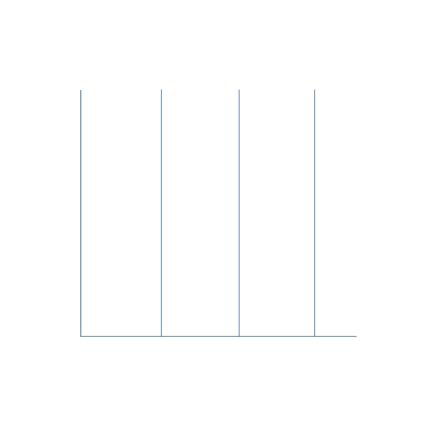
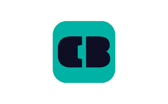

<!-- SACHIN R -->

<div align="center">


</div>

<div align="center">

[](https://git.io/typing-svg)

</div>
<h3 align="center">

<a href="https://github.com/ITRecruitersachin?tab=followers">
&nbsp;&nbsp;

<a href="https://github.com/ITRecruitersachin?tab=repositories">


         

</a>
</p>

---

<div align="center">


</div>

---

<p align="center">

<br>

 > ## 🌌 About Me — The Recruiter Behind the Code

 > ## 💡 Professional Summary
>
> Senior US IT Recruiter with **10+ years of experience** specializing in full-cycle technical recruitment across Fortune 500 enterprises, MSPs, direct clients, and consulting organizations.
>
> Experienced in sourcing, screening, and hiring professionals across Cloud, AI/ML, Data Engineering, Java, .NET, DevOps, Cybersecurity, SAP, Salesforce, ERP, QA, Networking, Infrastructure, Project Management, and emerging technologies.
>
> Passionate about leveraging AI-powered recruitment workflows, Boolean search, X-Ray sourcing, and modern recruiting technologies to deliver high-quality talent solutions.


<div align="center">
 
         Name: Sachin
         Role: IT Recruiter & Talent Strategist
         Location: United States
         Focus: Niche Tech Talent | Multi-Vendor Staffing | HBITS (NY State)
         Experience: IT • Engineering • AI/ML • Cybersecurity • ERP • Cloud • DevOps
         Network: Independent candidate database + large professional network
         Mode: Sub-vendor | Competitive multi-vendor environments
         Superpower: Finding the talent others can't — fast.
</div>

---

🎯 What I Recruit For
<div align="center">

         🤖 AI / ML	🔐 Cybersecurity	☁️ Cloud & DevOps
         Data Scientists	SOC Analysts	AWS / Azure / GCP
         ML Engineers	Penetration Testers	Kubernetes / Docker
         LLM Specialists	CISO / vCISO	CI/CD Engineers
         🏗️ ERP / SAP	🌐 Network Eng	📋 PM / BA
         SAP FICO / MM	Network Architects	Project Managers
         SAP Basis	CCNA / CCIE	Business Analysts
         SAP ABAP Dev	NOC Engineers	Scrum Masters


</div>

---

<!-- ===================================================== -->
<!--            📊 LIVE GITHUB ANALYTICS                  -->
<!-- ===================================================== -->

<h1 align="center">📊 Live GitHub Analytics</h1>

<p align="center">
<i>Real-time GitHub statistics updated automatically.</i>
</p>

## 🔥 Contribution Streak

<p align="center">


</p>

---

## 📈 Contribution Activity Graph

<p align="center">


</p>

---

## 🌍 Large Contribution Heatmap

<p align="center">


</p>

---

## ⚡ GitHub Metrics

<p align="center">


</p>

---

## 📊 Productivity Statistics

<p align="center">


</p>

---

<p align="center">


</p>

---

## 👀 Profile Visitors

<p align="center">


</p>

---

## ⭐ GitHub Overview

```text
╔══════════════════════════════════════════════════════════════╗
║                    LIVE GITHUB OVERVIEW                     ║
╠══════════════════════════════════════════════════════════════╣
║ 📊 Public Repositories      │ Live                          ║
║ ⭐ Total Stars              │ Live                          ║
║ 👥 Followers                │ Live                          ║
║ 🔥 Contribution Streak      │ Auto Updated                  ║
║ 📈 Contribution Graph       │ Auto Updated                  ║
║ 🏆 GitHub Achievements      │ Auto Updated                  ║
║ 🐍 Snake Animation          │ Daily Refresh                 ║
║ 🌍 Activity Heatmap         │ Auto Updated                  ║
╚══════════════════════════════════════════════════════════════╝
```

<div align="center">

### ⚡ Building the future of Technical Recruitment, one successful hire at a time.

</div>

<!-- ===================================================== -->
<!--                 💼 ABOUT ME                           -->
<!-- ===================================================== -->

---

## 🛰️ Job Boards & ATS

<div align="center">





</div>

---

## 🤖 AI Sourcing Tools

<div align="center">


</div>

---

## ✍️ AI Prompt Experience

<div align="center">


</div>

---

## 📡 Contact Enrichment Tools

<div align="center">


</div>

---

## 🔭 X-Ray & Portfolio Sourcing

```
site:github.com "python" "open to work"
site:stackoverflow.com/users "aws" "new york"
site:linkedin.com/in "machine learning engineer" "actively looking"
site:kaggle.com "data scientist" "top 1%"
```

<div align="center">


</div>

---

## 🌀 Pipeline Building · How Gravity Works

```
🔭  X-ray + Boolean sourcing across the open web
         ↓
📡  Contact enrichment — Apollo · ContactOut · RocketReach · Lusha
         ↓
🤖  AI-powered personalized outreach via Clay & Juicebox
         ↓
💬  Referral mining from not-interested candidates
    "Not looking? Who do you know that might be?" → 1 no = 3 new leads
         ↓
🗄️  Candidate added to own proprietary database
    Tagged by skill · location · availability · niche
         ↓
🔗  Nurtured via LinkedIn (15K+ network) + email sequences
    Warm pipeline — not cold outreach every time
         ↓
✅  Right candidate. Right role. Every time.
```

---

<div align="center">

</div>

---

<div align="center">

---

<div align="center">

🔗 Connect & Collaborate

<div align="center">
<a href="https://www.linkedin.com/in/recruitersachin">
  
</a>
&nbsp;
<a href="mailto:writeforsachin@gmail.com">
  
</a>
&nbsp;
<a href="https://calendly.com/YOUR-CALENDLY-LINK">
  
</a>
<br/><br/>
<a href="https://discord.com/users/sourcexsachin">
  
</a>
&nbsp;
<a href="https://stackoverflow.com/users/YOUR-SO-ID">
  
</a>
&nbsp;
<a href="https://github.com/ITRecruitersachin">
  
</a>
</div>

---

<div align="center">

<sub> US RECRUITER · IT · ENGINEERING · NON-IT · NICHE TECH </sub>

</div>

<div align="center">
   
</div>

---


---

<p align="center">

<br>

---
